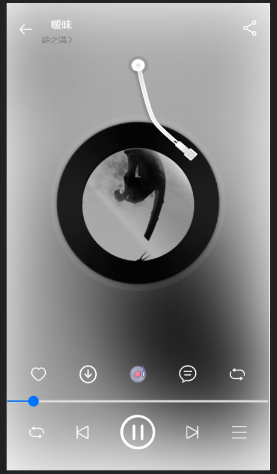

# 先去网易云node.js官网下载好后端包
官网：https://binaryify.github.io/NeteaseCloudMusicApi/#/?id=neteasecloudmusicapi
## 将后端接口开启
node ./app.js

# 安装依赖
npm i

# 将项目跑起来
npm run serve

效果图：
首页：

播放页面（未播放）：

播放页面（播放）：

